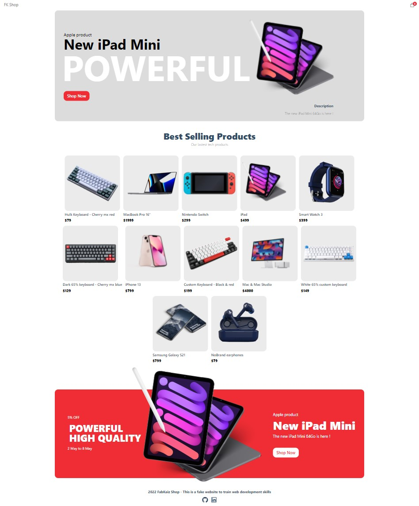

# 🛍️ e-commerce shop with NextJs, Sanity & Stripe 🛒
### This shop was made using: 
  * Sanity for the backend and CMS
  * NextJs for the frontend
  * Stripe for all the transactions
  * groq for the backend query
  * Canvas Confetti for the succes page
  * React hot toast for the notifications
  * Uploaded with Vercel
 
 ### [Click here to see the result 🛍️](https://sanity-stripe-shop.vercel.app/)

